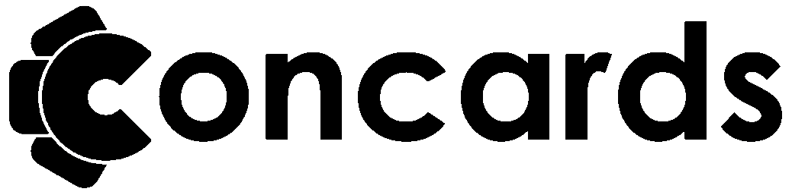

## concards 1.0
Turning notes into flashcards. Concards is my ongoing attempt to make
flashcards simple and quick to record or embed into a text document. Unlike the
overhead of other flashcard applications, Concards accepts a minimal amount of
rules. This allows tons of freedom in the way you want to create your own
flashcards!

## Install
Install like any other go application.
``` bash
go get github.com/alanxoc3/concards;
cd $GOPATH/src/github.com/alanxoc3/concards;
go build; # Or `./install.sh`
```

## Features
* Implements the [SM2](https://www.supermemo.com/english/ol/sm2.htm) Repetition Algorithm.
* Beautiful terminal gui.
* Supports UTF-8!
* Reading in from multiple files.
* Undoing/Redoing
* Easily editing a card while reviewing your cards.
* And More!!! (I think :)

## Usage
The file syntax was designed to be very simple and flexible, allowing anyone to
quickly embed flashcards into their text document without extra hassle of other
flashcard apps (like [Anki](https://apps.ankiweb.net/) or
[Memrise](https://www.memrise.com/)).

The syntax to embed your flashcards is like this:

    You can embed flashcards in any textfile. This is text before the flashcards!

    ## group1 GROUP2 group_3
    question1
       answer1 (3 spaces)

    question2
    still question2
       answer2 (3 spaces)

    ## newgroup
    question 3

    question 4
       But this one has an answer. (3 spaces)
    ##

    The '##' without a group ends the flashcards. So we can continue our text
    file here. But you can also have more cards later in the document!

<!--
## concard_group
Why do you love flashcards?
	Because I wanna learn stuff!
-->

Wanna try it out? Run concards on this README.md file!
``` bash
concards README.md
```

**Note**, this file format will be deprecated in version 2.0, with cleaner syntax.
